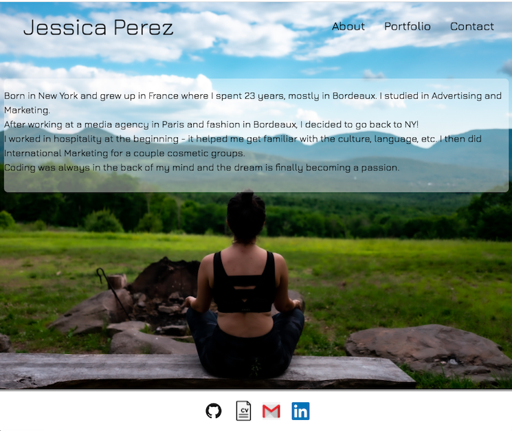

# Responsive Portfolio web app

## Purpose of this project

`Build a responsive Portfolio using Bootstrap CSS framework`

### What I did

``
I used Bootstrap components to build this responsive layout including the grid system, a navbar, images, working links, and a footer.
I did not use media queries.

``

### Project screenshots

## Project submissions

- The URL of the deployed application:
  [Deployed app URL](https://jessicaperez1.github.io/Portfolio-update/.)

- The URL of the GitHub repository:
  [GitHub repository URL](https://github.com/JessicaPerez1/Portfolio-update.git)
